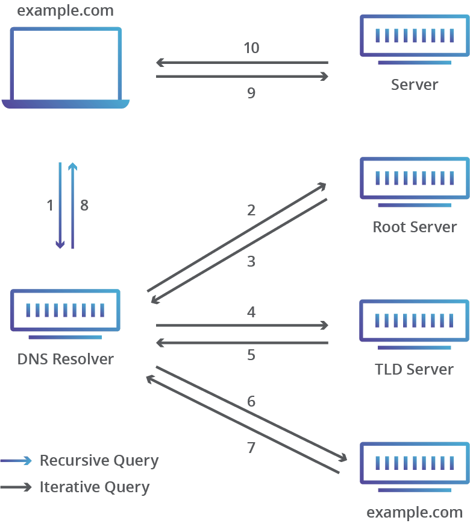

# DNS
All network systems work with network addresses such as IPv4 and IPv6. However, for most people, it is easier to work with names than with long and hard-to-remember strings of digits in network addresses. DNS, which is the system responsible for translating these domain names to their corresponding IP addresses, allows you to connect to servers or services using easily memorable names instead of their IP addresses. The oldest ARPANET systems (from which the internet evolved) mapped names to addresses using a hosts file, which was distributed to all entities whenever changes occurred. However, the operation of such a system became unsustainable once there were more than 100 connected entities, which led to the specification and implementation of the domain name system that we use today. [^dns_bind]. Communication with DNS typically uses TCP or UDP port 53 [^dns_wiki].

## Types of DNS Servers
The DNS name system is organized as a tree structure composed of multiple levels, which naturally creates a distributed system. Each node in the tree is labeled with a tag that defines its domain (area or zone) of authority.

- **Recursive resolvers:** In most cases, these are the first point of contact for DNS queries. They respond either with data from the cache or make queries to other DNS servers (root, TLD, authoritative). Well-known recursive resolvers include: `1.1.1.1` (Cloudflare) and `8.8.8.8` (Google), or for IPv6: `2606:4700:4700::1111` (Cloudflare), `2001:4860:4860::8888` (Google) [^cloudflare] [^cloudflare_ip] [^google_dns_ip].
- **Root nameservers:** The initial point of the query for a recursive nameserver. They direct the query to a Top Level Domain (TLD) nameserver based on the domain suffix (e.g., *.com*, *.org*).
- **TLD nameservers:** They direct queries to the authoritative nameserver for the specific domain (e.g., *google.com*, *wikipedia.org*).
- **Authoritative nameservers:** The final step in a DNS query. They contain the specific IP address for the domain or alias (CNAME) (e.g., *www.google.com*, *[cs.wikipedia.org](https://cs.wikipedia.org)*). In businesses and organizations, authoritative nameservers may also be used to handle internal DNS requests and manage internal domains [^cloudflare].

<figure markdown="1">

<figcaption markdown="1">
Example of a recursive DNS request [^cloudflare]
</figcaption>
</figure>

## References
[^dns_bind]: *BIND 9 docs: 1. Introduction to DNS and BIND 9* [online]. [cit. 2025-02-23]. Available from: https://bind9.readthedocs.io/en/v9.20.6/chapter1.html
[^dns_wiki]: *Wikipedia: Domain Name System* [online]. [cit. 2025-02-25]. Available from: https://en.wikipedia.org/wiki/Domain_Name_System
[^cloudflare]: *Cloudflare: DNS server types* [online]. [cit. 2025-02-25]. https://www.cloudflare.com/learning/dns/dns-server-types/
[^cloudflare_ip]: *Cloudflare Docs: IP addresses* [online]. [cit. 2025-02-25]. Available from: https://developers.cloudflare.com/1.1.1.1/ip-addresses/
[^google_dns_ip]: *Google Public DNS: Google Public DNS IP addresses* [online]. [cit. 2025-02-25]. Available from: https://developers.google.com/speed/public-dns/docs/using#addresses
