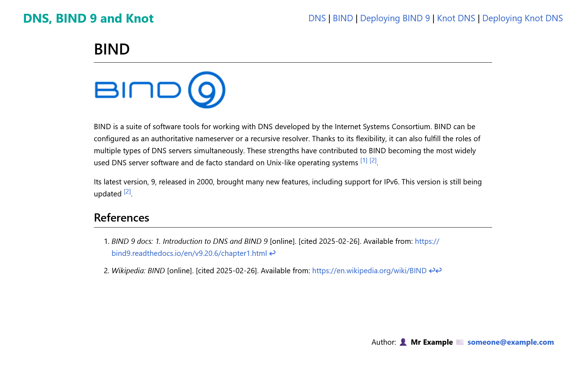

# MIZI-Web (Markdown izi web) 🌐

**MIZI-Web** is a lightweight framework (if I can call it that) that I originally developed for school projects. The goal was to create static websites on various topics. This project was intended to simplify the process of building static websites, with a focus on using Markdown to easily manage content and generate clean, simple pages. It’s designed to be simple and easy to use, making website creation more streamlined and focused on content rather than technical details.

## Features ✨
- **Simple setup**: The framework is designed to be easy to set up and get started with.
- **Static website generation**: Ideal for creating static web pages on any topic.
- **Customizable templates**: Users can easily customize the layout to fit their needs.
- **Markdown support**: Converts Markdown content into HTML for easier content management.

## Installation and usage 🛠️
1. Clone the repository.
2. Install requirements with `pip install -r requirements.txt`
3. Run the `build.py` or `build_watcher.py` file to generate the website files.
4. Customize the content and templates according to your project needs.

**Example content** can be found in the `content` directory, where you can add your own Markdown files for the framework to convert into static pages.

## Web demo
